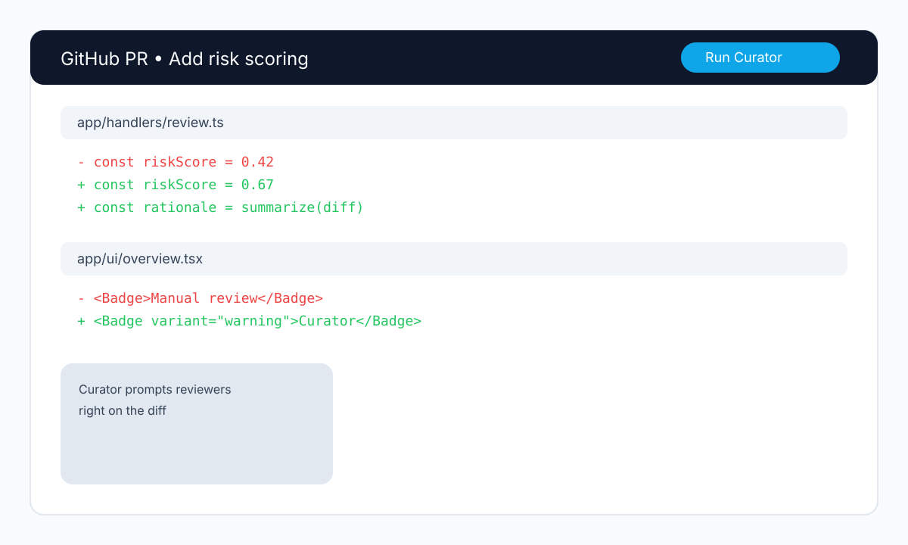
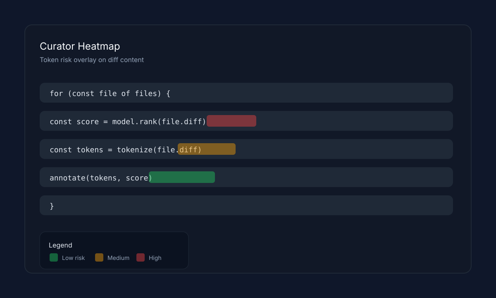
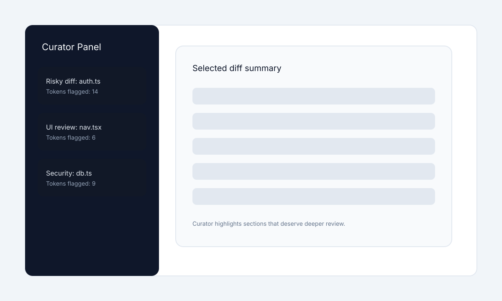
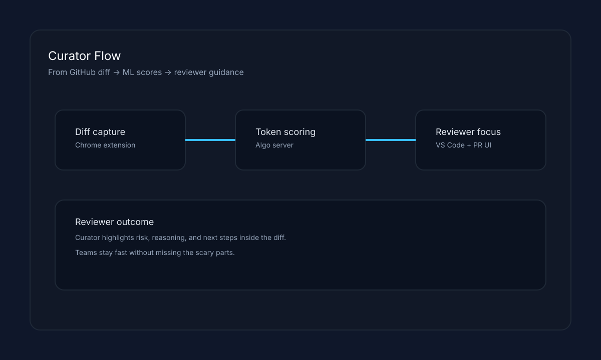

# hackathon-curator

**Grand Prize winner of the Man vs. Machine hackathon featured in Wired:** https://www.wired.com/story/san-francisco-hackathon-man-vs-machine/

Curator is a tiny toolkit that captures GitHub diffs, scores every token for risk, and overlays a heatmap so reviewers immediately see what matters.

## Product screenshots









## Run the algo server
```
cd algo
npm install
npm run dev
# localhost:3005
```

## Run the test server
```
cd test-server
npm install
npm run dev
# localhost:3030
```

## Run the curator extension
```
cd curator
npm install
npm run watch
npm run dev  # in new terminal
```
